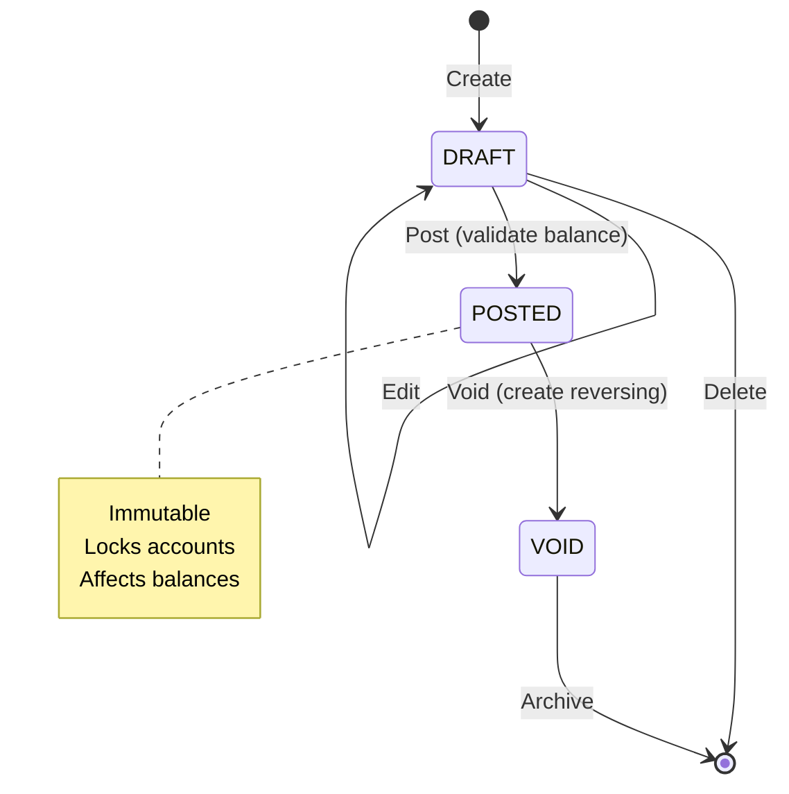
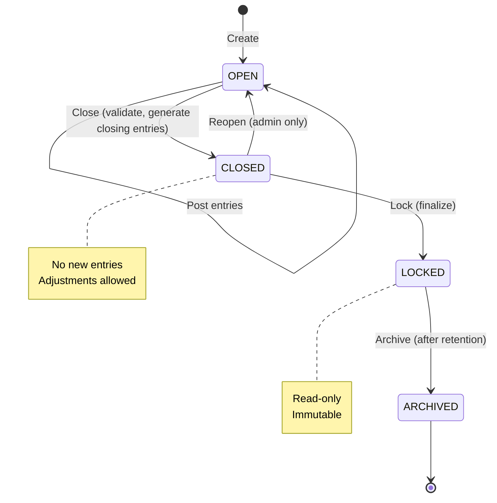
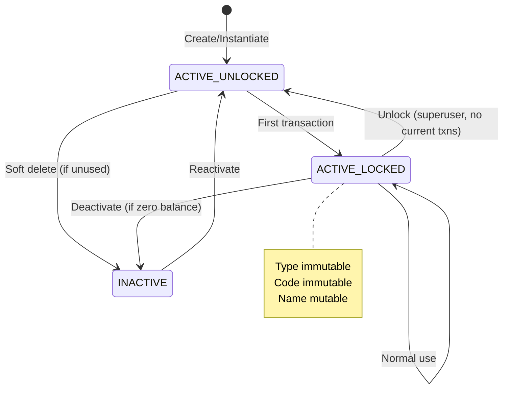

# Chart of Accounts - Canonical Model

**Version:** 1.0
**Date:** 2025-12-13
**Status:** Authoritative Reference

---

## 1. Conceptual Model

The Aequitas Chart of Accounts (CoA) operates on a **three-tier architecture**:

```
┌─────────────────────────────────────┐
│   Master Reference Chart (US-GAAP)  │  ← Immutable, versioned foundation
│        345 standardized accounts     │
└─────────────────────────────────────┘
              ↓ derives
┌─────────────────────────────────────┐
│      Chart Templates (Segments)      │  ← Industry/size-specific presets
│    Retail, Manufacturing, Startup    │
└─────────────────────────────────────┘
              ↓ instantiates
┌─────────────────────────────────────┐
│   Company-Specific Chart Instance    │  ← Operational, customizable
│       Active accounts + mappings     │
└─────────────────────────────────────┘
```

### 1.1 Master Reference Chart

**Purpose:** Immutable, GAAP-compliant foundation providing standardized account classifications.

**Properties:**
- **Hierarchical code structure**: `Level1.Level2.Level3.Level4` (e.g., `1.10.10.10` = Cash)
- **Account types**: Asset, Liability, Equity, Revenue, Expense
- **Normal balance**: Debit or Credit (derived from account type)
- **Header vs Detail**: Headers organize, details transact
- **Regulatory mappings**: ASC (US-GAAP), IAS, IFRS references
- **AI classification tags**: Industry, vendor, semantic tags for intelligent mapping

**Characteristics:**
- 345 total accounts (7 headers, 338 details)
- **Immutable** for companies (read-only reference)
- **Versioned** at system level (e.g., v2024.1, v2025.1)
- **Complete coverage** of all standard business account needs

**Data Model:**
```
MasterAccount
├── id (UUID)
├── code (hierarchical string, unique)
├── name (string)
├── account_type (enum: Asset|Liability|Equity|Revenue|Expense)
├── normal_balance (enum: Debit|Credit) [derived from type]
├── is_header (boolean)
├── parent_code (FK to MasterAccount.code, nullable)
├── asc_reference (string, nullable)
├── ias_reference (string, nullable)
├── ifrs_reference (string, nullable)
├── ai_tags (JSON array)
├── vendor_mappings (JSON object)
└── version (string, e.g., "2024.1")
```

### 1.2 Chart Templates

**Purpose:** Pre-configured, segment-specific subsets of the master chart for rapid company onboarding.

**Segmentation Dimensions:**
- **Industry**: Retail, Manufacturing, Services, Healthcare, Construction, etc.
- **Size**: Startup (<10 employees), SMB (10-500), Enterprise (500+)
- **Regulatory**: Public (SEC reporting), Private, Nonprofit, Government
- **Geography**: US-only, International, Multi-currency

**Template Configuration:**
```
ChartTemplate
├── id (UUID)
├── name (e.g., "Retail Startup - US Private")
├── industry (enum)
├── size_category (enum)
├── regulatory_context (enum)
├── included_accounts (array of MasterAccount codes)
├── mandatory_accounts (array of MasterAccount codes) [subset of included]
├── default_customizations (JSON: renames, additional accounts)
├── restrictions (JSON: locked accounts, forbidden operations)
└── created_at, updated_at
```

**Template Rules:**
1. **Inclusion**: Only master accounts present in template can be instantiated by default
2. **Mandatory subset**: Certain accounts (Cash, Retained Earnings, etc.) cannot be excluded
3. **Customization allowed**: Companies can rename, add custom accounts
4. **Restrictions**: Templates can forbid certain account deletions or modifications

**Mandatory Accounts (All Templates):**
- `1.10.10.10` - Cash (Asset)
- `2.10.10.10` - Accounts Payable (Liability)
- `3.10.10.10` - Common Stock (Equity)
- `3.30.10.10` - Retained Earnings (Equity)
- `4.10.10.10` - Revenue (Revenue)
- `5.10.10.10` - Cost of Goods Sold (Expense)

### 1.3 Company-Specific Chart

**Purpose:** Operational instance of the chart of accounts for a single company, derived from template and customizable.

**Data Model:**
```
CompanyAccount
├── id (UUID)
├── company_id (FK to Company)
├── code (string, unique within company)
├── name (string)
├── account_type (enum: Asset|Liability|Equity|Revenue|Expense)
├── normal_balance (enum: Debit|Credit)
├── is_header (boolean)
├── parent_id (FK to CompanyAccount, nullable)
├── is_active (boolean) [soft delete]
├── is_locked (boolean) [true after first transaction]
├── is_custom (boolean) [false if derived from master, true if custom]
├── mapped_master_account_id (FK to MasterAccount, nullable)
├── created_at, updated_at
├── deactivated_at (timestamp, nullable)
└── current_balance (decimal, computed)

AccountMapping [links CompanyAccount ↔ MasterAccount]
├── id (UUID)
├── company_account_id (FK)
├── master_account_id (FK)
├── mapping_confidence (float 0-1) [AI or manual]
├── mapping_source (enum: Template|AI|Manual)
└── created_at
```

**Lifecycle:**
1. **Instantiation**: Company selects template → accounts copied from master chart
2. **Customization**: Company adds custom accounts, renames, hides unused
3. **First Transaction**: Account locks (type/code immutable)
4. **Deactivation**: Account soft-deleted if unused, hidden if has history

**Customization Rules:**
- **Add custom accounts**: Allowed (mark `is_custom=true`)
- **Rename accounts**: Allowed before locking
- **Change account type**: Forbidden after first transaction
- **Delete mandatory accounts**: Forbidden
- **Delete accounts with history**: Forbidden (soft delete only)
- **Hide unused accounts**: Allowed (`is_active=false`)

---

## 2. GAAP-Compliant Hierarchy

### 2.1 Account Type Classification

```
1.XX.XX.XX — Assets (Normal Balance: Debit)
├── 1.10.XX.XX — Current Assets
│   ├── 1.10.10.XX — Cash and Cash Equivalents
│   ├── 1.10.20.XX — Accounts Receivable
│   └── 1.10.30.XX — Inventory
├── 1.20.XX.XX — Non-Current Assets
│   ├── 1.20.10.XX — Property, Plant & Equipment
│   └── 1.20.20.XX — Intangible Assets

2.XX.XX.XX — Liabilities (Normal Balance: Credit)
├── 2.10.XX.XX — Current Liabilities
│   ├── 2.10.10.XX — Accounts Payable
│   └── 2.10.20.XX — Accrued Expenses
├── 2.20.XX.XX — Non-Current Liabilities
│   └── 2.20.10.XX — Long-term Debt

3.XX.XX.XX — Equity (Normal Balance: Credit)
├── 3.10.XX.XX — Capital Stock
├── 3.20.XX.XX — Additional Paid-in Capital
└── 3.30.XX.XX — Retained Earnings

4.XX.XX.XX — Revenue (Normal Balance: Credit)
├── 4.10.XX.XX — Operating Revenue
└── 4.20.XX.XX — Non-Operating Revenue

5.XX.XX.XX — Expenses (Normal Balance: Debit)
├── 5.10.XX.XX — Cost of Goods Sold
├── 5.20.XX.XX — Operating Expenses
└── 5.30.XX.XX — Non-Operating Expenses
```

### 2.2 Normal Balance Derivation

**Rule:** Normal balance is deterministic from account type.

| Account Type | Normal Balance | Increases With | Decreases With |
|--------------|----------------|----------------|----------------|
| Asset        | Debit          | Debit          | Credit         |
| Expense      | Debit          | Debit          | Credit         |
| Liability    | Credit         | Credit         | Debit          |
| Equity       | Credit         | Credit         | Debit          |
| Revenue      | Credit         | Credit         | Debit          |

**Contra Accounts** (exceptions):
- Accumulated Depreciation (contra-asset, credit balance)
- Sales Returns & Allowances (contra-revenue, debit balance)
- Treasury Stock (contra-equity, debit balance)

**Implementation:** Mark contra accounts with `is_contra=true` flag and invert normal balance.

### 2.3 Hierarchical Integrity

**Invariants:**
1. **Parent-child relationship**: Detail accounts must reference valid parent (or null for top-level)
2. **No cycles**: Account cannot be its own ancestor
3. **Header transactions forbidden**: Only detail accounts can have journal entry lines
4. **Type inheritance**: Child account type must match parent's top-level type (e.g., all 1.XX.XX.XX are Assets)

**Validation Rules:**
```sql
-- No cycles
NOT EXISTS (
  WITH RECURSIVE ancestors AS (
    SELECT id, parent_id FROM company_accounts WHERE id = NEW.id
    UNION
    SELECT ca.id, ca.parent_id FROM company_accounts ca
    JOIN ancestors a ON ca.id = a.parent_id
  )
  SELECT 1 FROM ancestors WHERE parent_id = NEW.id
)

-- Type consistency
NEW.account_type = (
  SELECT account_type FROM company_accounts WHERE id = NEW.parent_id
)
```

---

## 3. Debit/Credit Nature Enforcement

### 3.1 Double-Entry Validation

**Fundamental Equation:**
```
∑ Debits = ∑ Credits (for every journal entry)
```

**Implementation:**
```python
def validate_journal_entry(lines: List[JournalEntryLine]) -> bool:
    total_debits = sum(line.debit_amount for line in lines)
    total_credits = sum(line.credit_amount for line in lines)

    # Must balance to the penny (no floating point)
    return total_debits == total_credits and total_debits > 0
```

**Precision:** Use `DECIMAL(19, 2)` for all monetary amounts (no floating point).

### 3.2 Balance Calculation

**Account Balance Formula:**
```python
def calculate_account_balance(
    account: CompanyAccount,
    fiscal_period: FiscalPeriod
) -> Decimal:
    """
    Calculate account balance respecting normal balance.

    Normal Debit (Asset, Expense):
        Balance = ∑ Debits - ∑ Credits

    Normal Credit (Liability, Equity, Revenue):
        Balance = ∑ Credits - ∑ Debits
    """
    debits = sum_debits_for_account(account.id, fiscal_period)
    credits = sum_credits_for_account(account.id, fiscal_period)

    if account.normal_balance == NormalBalance.DEBIT:
        return debits - credits
    else:
        return credits - debits
```

### 3.3 Trial Balance Validation

**Invariant:** At any point in time:
```
∑ (Debit balances) = ∑ (Credit balances)
```

**Implementation:**
```python
def validate_trial_balance(company_id: UUID, as_of: date) -> bool:
    accounts = get_active_accounts(company_id)

    debit_balances = sum(
        account.balance for account in accounts
        if account.balance > 0 and account.normal_balance == NormalBalance.DEBIT
    )

    credit_balances = sum(
        account.balance for account in accounts
        if account.balance > 0 and account.normal_balance == NormalBalance.CREDIT
    )

    return debit_balances == credit_balances
```

---

## 4. Mandatory Accounts

### 4.1 GAAP-Required Accounts

**Balance Sheet (Minimum):**
```
Assets:
  1.10.10.10 - Cash and Cash Equivalents
  1.10.20.10 - Accounts Receivable

Liabilities:
  2.10.10.10 - Accounts Payable

Equity:
  3.10.10.10 - Common Stock
  3.30.10.10 - Retained Earnings
```

**Income Statement (Minimum):**
```
Revenue:
  4.10.10.10 - Revenue (or specific revenue account)

Expenses:
  5.10.10.10 - Cost of Goods Sold
  5.20.10.10 - Operating Expenses
```

### 4.2 Enforcement Rules

**Database Constraint:**
```sql
-- Prevent deletion of mandatory accounts
CREATE TRIGGER prevent_mandatory_account_deletion
BEFORE DELETE ON company_accounts
FOR EACH ROW
WHEN OLD.is_mandatory = true
BEGIN
  SELECT RAISE(ABORT, 'Cannot delete mandatory account');
END;
```

**Application Logic:**
```python
MANDATORY_MASTER_CODES = [
    "1.10.10.10",  # Cash
    "2.10.10.10",  # Accounts Payable
    "3.10.10.10",  # Common Stock
    "3.30.10.10",  # Retained Earnings
    "4.10.10.10",  # Revenue
    "5.10.10.10",  # COGS
]

def validate_chart_completeness(company_id: UUID) -> List[str]:
    """Return list of missing mandatory accounts."""
    mapped_codes = get_mapped_master_codes(company_id)
    return [
        code for code in MANDATORY_MASTER_CODES
        if code not in mapped_codes
    ]
```

### 4.3 Template Override

**Exception:** Templates can designate additional mandatory accounts beyond system defaults.

Example: **Retail template** makes `1.10.30.10 - Inventory` mandatory.

---

## 5. Account Locking Rules

### 5.1 Lock Triggers

**Accounts lock when:**
1. **First transaction posted**: Account appears in posted journal entry
2. **Fiscal period closed**: All accounts in period become read-only
3. **Manual lock**: User explicitly locks account (rare)

**Lock Status:**
```
CompanyAccount.is_locked = true
CompanyAccount.locked_at = timestamp
CompanyAccount.locked_reason = enum(FirstTransaction|PeriodClose|Manual)
```

### 5.2 Locked Account Restrictions

**Forbidden Operations (when `is_locked=true`):**
- ❌ Change `account_type`
- ❌ Change `code`
- ❌ Change `normal_balance`
- ❌ Change `is_header`
- ❌ Delete account
- ❌ Change `mapped_master_account_id` (if derived from template)

**Allowed Operations:**
- ✅ Rename (`name` field)
- ✅ Update description
- ✅ Soft delete (`is_active=false`) if no balance
- ✅ Add to journal entries (operational use)

### 5.3 Unlocking Protocol

**Unlocking requires:**
1. **Superuser privilege** or **Company Admin** role
2. **No posted transactions** in current fiscal period
3. **Explicit audit trail** of unlock reason

**Implementation:**
```python
@require_superuser
def unlock_account(
    account_id: UUID,
    reason: str,
    user_id: UUID
) -> None:
    """Unlock account with full audit trail."""
    account = get_account(account_id)

    if has_posted_transactions_in_current_period(account):
        raise ValidationError("Cannot unlock account with posted transactions")

    account.is_locked = False
    account.unlocked_at = datetime.utcnow()
    account.unlocked_by = user_id
    account.unlock_reason = reason

    # Audit log
    create_audit_entry(
        entity="CompanyAccount",
        entity_id=account_id,
        action="UNLOCK",
        user_id=user_id,
        reason=reason
    )
```

---

## 6. Template Derivation vs Company Customization

### 6.1 Derivation Process

**Step 1: Template Selection**
```
User selects template → "Retail Startup - US Private"
```

**Step 2: Account Instantiation**
```python
def instantiate_chart_from_template(
    company_id: UUID,
    template_id: UUID
) -> List[CompanyAccount]:
    """
    Copy master accounts from template to company.
    Maintain mapping to master chart.
    """
    template = get_template(template_id)
    company_accounts = []

    for master_code in template.included_accounts:
        master_account = get_master_account_by_code(master_code)

        company_account = CompanyAccount(
            company_id=company_id,
            code=master_account.code,  # Can be changed later
            name=master_account.name,  # Can be renamed
            account_type=master_account.account_type,
            normal_balance=master_account.normal_balance,
            is_header=master_account.is_header,
            is_custom=False,  # Template-derived
            mapped_master_account_id=master_account.id
        )

        company_accounts.append(company_account)

        # Create mapping
        AccountMapping(
            company_account_id=company_account.id,
            master_account_id=master_account.id,
            mapping_confidence=1.0,
            mapping_source=MappingSource.TEMPLATE
        )

    return company_accounts
```

**Step 3: Apply Default Customizations**
```python
# Template may specify renames
for rename in template.default_customizations.get("renames", []):
    account = find_account_by_code(company_id, rename["code"])
    account.name = rename["new_name"]
```

### 6.2 Customization Boundaries

**Allowed Customizations:**

| Operation | Before Lock | After Lock | Requires Mapping Update |
|-----------|-------------|------------|-------------------------|
| Rename account | ✅ | ✅ | No |
| Add custom account | ✅ | ✅ | Yes (AI suggestion) |
| Change account code | ✅ | ❌ | No |
| Hide unused account | ✅ | ✅ (if zero balance) | No |
| Delete account | ✅ (if unused) | ❌ | N/A |
| Change type | ✅ (discouraged) | ❌ | Yes |

**Custom Account Creation:**
```python
def create_custom_account(
    company_id: UUID,
    code: str,
    name: str,
    account_type: AccountType,
    parent_id: Optional[UUID] = None
) -> CompanyAccount:
    """
    Create custom account not in master chart.
    AI suggests best master account mapping.
    """
    account = CompanyAccount(
        company_id=company_id,
        code=code,
        name=name,
        account_type=account_type,
        normal_balance=derive_normal_balance(account_type),
        is_custom=True,
        parent_id=parent_id
    )

    # AI-powered mapping suggestion
    suggested_master = ai_suggest_master_account(
        account_name=name,
        account_type=account_type
    )

    if suggested_master:
        AccountMapping(
            company_account_id=account.id,
            master_account_id=suggested_master.id,
            mapping_confidence=suggested_master.confidence,
            mapping_source=MappingSource.AI
        )

    return account
```

### 6.3 Mapping Maintenance

**Mapping Sources (priority order):**
1. **Template**: Explicit derivation from template (confidence=1.0)
2. **Manual**: User explicitly maps (confidence=1.0)
3. **AI**: Dexter AI suggests based on semantic similarity (confidence=0.6-0.95)
4. **Vector**: pgvector similarity search (confidence=0.5-0.85)

**Mapping Update Triggers:**
- Custom account created → AI suggests mapping
- Account renamed → Re-evaluate mapping confidence
- Account type changed → Invalidate mapping, require re-mapping

**Unmapped Accounts:**
- Custom accounts without mapping lose AI classification benefits
- Reports may exclude unmapped accounts from industry benchmarks
- Warning displayed in UI for unmapped accounts

---

## 7. Audit Safety (Historical Immutability)

### 7.1 Immutability Principles

**GAAP Requirement:** Posted financial records must be tamper-proof.

**Immutable Entities:**
1. **Posted Journal Entries** (`status=posted`)
2. **Closed Fiscal Periods** (`status=closed` or `status=locked`)
3. **Master Chart** (for companies; system can version)

### 7.2 Journal Entry State Machine

```
┌───────┐  post()   ┌────────┐  void()   ┌──────┐
│ DRAFT │ ────────> │ POSTED │ ────────> │ VOID │
└───────┘           └────────┘           └──────┘
    ↑                   │                     │
    │                   │                     │
    └───────────────────┴─────────────────────┘
         (no mutation allowed)
```

**State Transitions:**
- `DRAFT → POSTED`: Validates balances, locks accounts, sets `posted_at`
- `POSTED → VOID`: Creates reversing entry, sets `voided_at`, preserves original
- `DRAFT → DRAFT`: Mutable (edits allowed)

**Forbidden Operations:**
```python
def edit_posted_journal_entry(entry_id: UUID) -> None:
    """THIS MUST NEVER EXIST."""
    raise ForbiddenOperationError(
        "Posted journal entries are immutable. "
        "To correct, create a reversing entry and a new entry."
    )
```

### 7.3 Fiscal Period Locking

**Lifecycle:**
```
OPEN → CLOSED → LOCKED → ARCHIVED
```

**State Definitions:**
- **OPEN**: Transactions allowed
- **CLOSED**: No new transactions, adjustments allowed with approval
- **LOCKED**: No modifications, read-only
- **ARCHIVED**: Moved to long-term storage, restricted access

**Close Process:**
```python
def close_fiscal_period(period_id: UUID, user_id: UUID) -> None:
    """
    Close fiscal period after validation.
    """
    period = get_fiscal_period(period_id)

    # Validation
    if not trial_balance_is_balanced(period):
        raise ValidationError("Trial balance does not balance")

    if has_unposted_entries(period):
        raise ValidationError("All entries must be posted before close")

    # Close
    period.status = FiscalPeriodStatus.CLOSED
    period.closed_at = datetime.utcnow()
    period.closed_by = user_id

    # Lock all accounts in period
    lock_accounts_for_period(period)

    # Generate closing entries (Revenue/Expense → Retained Earnings)
    generate_closing_entries(period)
```

### 7.4 Audit Trail

**Every mutation tracked:**
```
AuditLog
├── id (UUID)
├── entity_type (enum: JournalEntry|CompanyAccount|FiscalPeriod|...)
├── entity_id (UUID)
├── action (enum: CREATE|UPDATE|DELETE|POST|VOID|LOCK|UNLOCK)
├── user_id (FK to User)
├── timestamp (timestamptz)
├── old_value (JSON snapshot)
├── new_value (JSON snapshot)
├── reason (text, required for sensitive operations)
└── ip_address (inet)
```

**Retention:** Audit logs are never deleted (compliance requirement).

---

## 8. Invariants (Must Always Hold)

### 8.1 Database-Level Invariants

**Enforced via constraints:**

```sql
-- 1. Double-entry balance
CREATE OR REPLACE FUNCTION check_journal_entry_balance()
RETURNS TRIGGER AS $$
BEGIN
  IF (
    SELECT SUM(debit_amount) - SUM(credit_amount)
    FROM journal_entry_lines
    WHERE journal_entry_id = NEW.journal_entry_id
  ) != 0 THEN
    RAISE EXCEPTION 'Journal entry does not balance';
  END IF;
  RETURN NEW;
END;
$$ LANGUAGE plpgsql;

-- 2. No negative amounts
ALTER TABLE journal_entry_lines
ADD CONSTRAINT positive_amounts CHECK (
  debit_amount >= 0 AND credit_amount >= 0
);

-- 3. Exactly one amount per line (debit XOR credit)
ALTER TABLE journal_entry_lines
ADD CONSTRAINT debit_or_credit CHECK (
  (debit_amount > 0 AND credit_amount = 0) OR
  (debit_amount = 0 AND credit_amount > 0)
);

-- 4. Account type immutability after first transaction
CREATE OR REPLACE FUNCTION prevent_type_change_after_transaction()
RETURNS TRIGGER AS $$
BEGIN
  IF OLD.account_type != NEW.account_type AND OLD.is_locked = true THEN
    RAISE EXCEPTION 'Cannot change account type after transactions posted';
  END IF;
  RETURN NEW;
END;
$$ LANGUAGE plpgsql;

-- 5. Fiscal period date overlap prevention
CREATE UNIQUE INDEX idx_no_overlapping_periods
ON fiscal_periods (company_id, daterange(start_date, end_date, '[]'))
WHERE status != 'ARCHIVED';
```

### 8.2 Application-Level Invariants

**Business Rule Validation:**

```python
INVARIANTS = [
    # Accounting equation: Assets = Liabilities + Equity
    lambda company: (
        sum_account_balances(company, AccountType.ASSET) ==
        sum_account_balances(company, AccountType.LIABILITY) +
        sum_account_balances(company, AccountType.EQUITY)
    ),

    # Trial balance: Debit balances = Credit balances
    lambda company: trial_balance_is_balanced(company),

    # Retained earnings = Net Income (cumulative)
    lambda company: (
        get_retained_earnings_balance(company) ==
        calculate_cumulative_net_income(company)
    ),

    # All posted entries are balanced
    lambda company: all(
        entry.is_balanced() for entry in get_posted_entries(company)
    ),

    # No orphaned mappings
    lambda: not exists_unmapped_company_accounts(),

    # Mandatory accounts present
    lambda company: all(
        has_account_for_master_code(company, code)
        for code in MANDATORY_MASTER_CODES
    ),
]

def validate_system_invariants(company_id: UUID) -> List[str]:
    """Run all invariant checks, return violations."""
    violations = []
    for i, invariant in enumerate(INVARIANTS):
        try:
            if not invariant(company_id):
                violations.append(f"Invariant {i+1} violated")
        except Exception as e:
            violations.append(f"Invariant {i+1} check failed: {e}")
    return violations
```

### 8.3 Temporal Invariants

**Time-based consistency:**

1. **Fiscal Period Sequence**: Periods must be contiguous without gaps
2. **Transaction Dating**: Journal entry date must fall within an open fiscal period
3. **Posting Order**: Entries posted in chronological order within period
4. **Closing Entry Timing**: Closing entries must be last entries in period

```python
def validate_temporal_integrity(company_id: UUID) -> bool:
    periods = get_fiscal_periods(company_id, order_by="start_date")

    # Check contiguity
    for i in range(len(periods) - 1):
        if periods[i].end_date + timedelta(days=1) != periods[i+1].start_date:
            raise IntegrityError("Fiscal periods must be contiguous")

    # Check transaction dates
    for entry in get_journal_entries(company_id):
        period = find_period_for_date(entry.entry_date)
        if period.status != FiscalPeriodStatus.OPEN:
            raise IntegrityError(f"Entry dated in closed period: {entry.id}")

    return True
```

---

## 9. Forbidden Operations

### 9.1 Absolute Prohibitions

**These operations must NEVER be allowed:**

```python
class ForbiddenOperations:
    """
    Operations that would violate GAAP, audit trails, or data integrity.
    """

    @forbidden
    def edit_posted_journal_entry(entry_id: UUID) -> None:
        """Posted entries are immutable."""
        raise ForbiddenOperationError("Use reversing entries instead")

    @forbidden
    def delete_account_with_transactions(account_id: UUID) -> None:
        """Accounts with history cannot be deleted."""
        raise ForbiddenOperationError("Use soft delete (is_active=false)")

    @forbidden
    def change_account_type_after_lock(account_id: UUID, new_type: AccountType) -> None:
        """Account type is immutable after first transaction."""
        raise ForbiddenOperationError("Create new account instead")

    @forbidden
    def modify_master_chart_for_company(company_id: UUID, master_account_id: UUID) -> None:
        """Master chart is read-only reference."""
        raise ForbiddenOperationError("Master chart is system-managed")

    @forbidden
    def delete_mandatory_account(account_id: UUID) -> None:
        """GAAP-required accounts cannot be removed."""
        raise ForbiddenOperationError("This account is required by GAAP")

    @forbidden
    def post_entry_in_closed_period(entry: JournalEntry) -> None:
        """Closed periods are immutable."""
        raise ForbiddenOperationError("Reopen period or use adjusting entry")

    @forbidden
    def modify_fiscal_period_dates_after_transactions(period_id: UUID) -> None:
        """Period boundaries are immutable after first transaction."""
        raise ForbiddenOperationError("Create new period instead")

    @forbidden
    def delete_fiscal_period_with_transactions(period_id: UUID) -> None:
        """Periods with transactions cannot be deleted."""
        raise ForbiddenOperationError("Archive period instead")

    @forbidden
    def skip_double_entry_validation(entry: JournalEntry) -> None:
        """All entries must balance, no exceptions."""
        raise ForbiddenOperationError("Double-entry is fundamental")

    @forbidden
    def create_negative_balance_where_impossible(account: CompanyAccount) -> None:
        """Assets, some equity accounts cannot have negative balances."""
        raise ForbiddenOperationError("Balance violates account nature")
```

### 9.2 Restricted Operations

**Require elevated privileges:**

```python
class RestrictedOperations:
    """
    Operations allowed only with specific roles/permissions.
    """

    @require_role(Role.SUPERUSER)
    def unlock_locked_account(account_id: UUID, reason: str) -> None:
        """Unlock account after audit review."""
        pass

    @require_role(Role.ADMIN)
    def reopen_closed_period(period_id: UUID, reason: str) -> None:
        """Reopen fiscal period for adjustments."""
        pass

    @require_role(Role.SUPERUSER)
    def modify_master_chart_version(version: str) -> None:
        """Update master chart (system-level only)."""
        pass

    @require_permission("void_posted_entries")
    def void_posted_entry(entry_id: UUID, reason: str) -> None:
        """Void entry (creates reversing entry, preserves original)."""
        pass

    @require_permission("manage_templates")
    def modify_chart_template(template_id: UUID) -> None:
        """Update template (affects new companies only)."""
        pass
```

### 9.3 Dangerous Operations (Require Confirmation)

**Destructive actions requiring explicit user confirmation:**

- Delete company (cascades to all accounts, entries)
- Delete chart template (affects companies using it)
- Purge audit logs (compliance violation in most jurisdictions)
- Hard delete fiscal periods (lose historical data)
- Reset company chart (lose all customizations)

---

## 10. Recommended Defaults

### 10.1 New Company Setup

**Default Template:** "Startup - General Business - US Private"

**Included Accounts:**
- Essential balance sheet accounts (10-15 accounts)
- Basic revenue/expense accounts (5-10 accounts)
- Total: ~25 accounts (enough to start, not overwhelming)

**Default Fiscal Period:**
- Align with calendar year (Jan 1 - Dec 31)
- OR align with company incorporation date
- Status: OPEN
- First period is current year

### 10.2 Default Account Settings

```python
DEFAULT_ACCOUNT_SETTINGS = {
    "allow_negative_balance": False,  # Except for contra accounts
    "require_description": True,      # For journal entry lines
    "auto_lock_on_first_transaction": True,
    "soft_delete_only": True,         # Never hard delete accounts
    "require_mapping_for_custom_accounts": True,
}
```

### 10.3 Journal Entry Defaults

```python
DEFAULT_ENTRY_SETTINGS = {
    "default_status": JournalEntryStatus.DRAFT,
    "require_description": True,
    "require_reference": False,  # Optional reference number
    "auto_generate_entry_number": True,  # Sequential numbering
    "allow_future_dates": False,  # Prevent future-dating
    "allow_past_period_dates": False,  # Prevent backdating to closed periods
}
```

### 10.4 Fiscal Period Defaults

```python
DEFAULT_PERIOD_SETTINGS = {
    "period_length": "monthly",  # or "quarterly", "annual"
    "auto_create_next_period": True,  # When closing current
    "require_balanced_trial_before_close": True,
    "generate_closing_entries": True,  # Revenue/Expense → Retained Earnings
    "lock_after_close": False,  # CLOSED vs LOCKED distinction
}
```

### 10.5 Master Chart Mapping Defaults

```python
DEFAULT_MAPPING_SETTINGS = {
    "auto_map_on_template_instantiation": True,
    "ai_suggest_for_custom_accounts": True,
    "minimum_confidence_threshold": 0.7,  # For auto-mapping
    "fallback_to_vector_search": True,
    "allow_manual_override": True,
}
```

### 10.6 Chart Template Recommendations

**Startup (<10 employees):**
- 25-30 accounts (minimal complexity)
- Templates: "Startup - Software SaaS", "Startup - Retail", "Startup - Services"

**SMB (10-500 employees):**
- 50-100 accounts (department-level detail)
- Templates: "SMB - Manufacturing", "SMB - Healthcare", "SMB - Construction"

**Enterprise (500+ employees):**
- 150-300 accounts (cost center granularity)
- Templates: "Enterprise - Multi-division", "Enterprise - Public Company"

---

## 11. Implementation Checklist

### 11.1 Database Schema

- [ ] `MasterAccount` table with hierarchical code structure
- [ ] `ChartTemplate` table with segment configuration
- [ ] `CompanyAccount` table with locking, customization flags
- [ ] `AccountMapping` table with confidence scoring
- [ ] `JournalEntry` and `JournalEntryLine` with state machine
- [ ] `FiscalPeriod` with lifecycle states
- [ ] `AuditLog` for all mutations
- [ ] Constraints for double-entry balance, positive amounts, no cycles
- [ ] Triggers for account locking, type immutability, period overlap prevention

### 11.2 Backend Services

- [ ] `MasterChartService` (read-only operations, versioning)
- [ ] `TemplateService` (CRUD, instantiation logic)
- [ ] `CompanyChartService` (customization, locking, mapping)
- [ ] `JournalEntryService` (CRUD, posting, voiding)
- [ ] `FiscalPeriodService` (lifecycle management, closing)
- [ ] `AccountingValidationService` (invariant checks, trial balance)
- [ ] `MappingService` (AI suggestions, vector search, manual overrides)
- [ ] `AuditService` (immutable logging, compliance reports)

### 11.3 Frontend Pages

- [ ] Master Chart Viewer (read-only, reference)
- [ ] Company Chart Manager (customization, locking UI)
- [ ] Template Selector (onboarding flow)
- [ ] Account Mapping Interface (AI suggestions, manual override)
- [ ] Journal Entry Form (double-entry UI, validation)
- [ ] Fiscal Period Management (lifecycle, closing wizard)
- [ ] Trial Balance Report (validation, drill-down)
- [ ] Audit Trail Viewer (immutability verification)

### 11.4 API Endpoints

```
GET    /api/v1/masterchart                    # List master accounts
GET    /api/v1/masterchart/{code}              # Get master account details
GET    /api/v1/templates                       # List templates
POST   /api/v1/companies/{id}/chart/instantiate  # Instantiate from template
GET    /api/v1/companies/{id}/chart            # Get company chart
POST   /api/v1/companies/{id}/chart/accounts   # Create custom account
PATCH  /api/v1/companies/{id}/chart/accounts/{id}  # Update account
DELETE /api/v1/companies/{id}/chart/accounts/{id}  # Soft delete account
POST   /api/v1/companies/{id}/chart/accounts/{id}/lock    # Lock account
POST   /api/v1/companies/{id}/chart/accounts/{id}/unlock  # Unlock account
GET    /api/v1/companies/{id}/chart/mappings   # Get account mappings
POST   /api/v1/companies/{id}/chart/mappings   # Create/update mapping
POST   /api/v1/companies/{id}/chart/validate   # Run invariant checks
```

### 11.5 Testing

- [ ] Unit tests for all invariant checks
- [ ] Integration tests for template instantiation
- [ ] Double-entry validation tests (balanced, unbalanced, edge cases)
- [ ] Account locking workflow tests
- [ ] Fiscal period lifecycle tests
- [ ] Audit trail immutability tests
- [ ] GAAP compliance tests (accounting equation, trial balance)
- [ ] Performance tests (large chart, many transactions)

---

## 12. Migration Path

### 12.1 For Existing Companies

**Companies created before this model:**

1. **Analysis Phase:**
   - Identify current accounts and their usage
   - Map existing accounts to master chart
   - Detect unmapped custom accounts

2. **Mapping Phase:**
   - AI-assisted mapping suggestions
   - Manual review and confirmation
   - Document mapping confidence

3. **Lock Phase:**
   - Lock accounts with transaction history
   - Preserve existing balances
   - Validate trial balance integrity

4. **Audit Phase:**
   - Generate pre-migration snapshot
   - Verify accounting equation still holds
   - Create audit trail entry for migration

### 12.2 For New Companies

**Greenfield setup (recommended flow):**

1. Company registration → Template selection
2. Chart instantiation from template
3. Review and customize (optional)
4. First fiscal period creation
5. Ready to record transactions

---

## 13. Governance

### 13.1 Master Chart Versioning

**Version Format:** `YYYY.Q` (e.g., `2024.1`, `2024.2`, `2025.1`)

**Update Triggers:**
- New GAAP standards (ASC updates)
- New IFRS/IAS requirements
- Industry-specific account additions
- Regulatory changes (SEC, PCAOB)

**Update Process:**
1. Propose changes in staging environment
2. Review by accounting team
3. Impact analysis on existing companies
4. Release with migration guide
5. Companies opt-in to new version (not automatic)

### 13.2 Template Governance

**Template Ownership:**
- System templates (maintained by Aequitas core team)
- Company templates (custom templates for specific orgs)
- Community templates (shared, vetted templates)

**Template Updates:**
- Do NOT affect existing companies
- Only apply to new companies selecting template
- Version templates alongside master chart

### 13.3 Change Review Board

**For breaking changes:**
- Account code structure changes
- Mandatory account list changes
- Invariant rule changes
- API contract changes

**Approval Required From:**
- Lead Architect (Thome)
- Senior Accountant (GAAP expert)
- Lead Engineer (Claude Code / technical lead)

---

## 14. Future Enhancements

### 14.1 Planned Features

1. **Multi-currency support**: Additional `currency_code` field, FX gain/loss accounts
2. **Consolidation**: Parent-subsidiary account mapping, elimination entries
3. **Segment reporting**: Divisions, departments, cost centers as dimensions
4. **Budget vs Actual**: Budget accounts parallel to actual accounts
5. **Industry-specific accounts**: Healthcare (CPT codes), Construction (WBS), etc.

### 14.2 Research Areas

1. **XBRL tagging**: Auto-tagging for SEC filings
2. **AI-powered account suggestions**: During transaction entry
3. **Anomaly detection**: Unusual account balances, suspicious entries
4. **Benchmarking**: Industry comparisons using mapped master chart

---

## Appendix A: Example Chart Hierarchies

### A.1 Minimal Chart (Startup)

```
1.10.10.10 - Cash and Cash Equivalents
1.10.20.10 - Accounts Receivable
1.20.10.10 - Equipment
1.20.10.20 - Accumulated Depreciation - Equipment

2.10.10.10 - Accounts Payable
2.10.20.10 - Accrued Expenses
2.20.10.10 - Long-term Debt

3.10.10.10 - Common Stock
3.30.10.10 - Retained Earnings

4.10.10.10 - Service Revenue

5.10.10.10 - Cost of Services
5.20.10.10 - Salaries and Wages
5.20.20.10 - Rent Expense
5.20.30.10 - Office Supplies
5.20.40.10 - Depreciation Expense
```

### A.2 Retail Chart (SMB)

```
Assets:
  1.10.10.10 - Cash - Operating Account
  1.10.10.20 - Cash - Payroll Account
  1.10.20.10 - Accounts Receivable
  1.10.20.20 - Allowance for Doubtful Accounts
  1.10.30.10 - Inventory - Finished Goods
  1.10.30.20 - Inventory - Supplies
  1.10.40.10 - Prepaid Rent
  1.20.10.10 - Store Equipment
  1.20.10.20 - Accumulated Depreciation - Store Equipment
  1.20.20.10 - Leasehold Improvements

Liabilities:
  2.10.10.10 - Accounts Payable
  2.10.20.10 - Sales Tax Payable
  2.10.30.10 - Payroll Liabilities
  2.20.10.10 - Notes Payable - Long-term

Equity:
  3.10.10.10 - Common Stock
  3.20.10.10 - Additional Paid-in Capital
  3.30.10.10 - Retained Earnings
  3.40.10.10 - Owner's Draws

Revenue:
  4.10.10.10 - Retail Sales
  4.10.10.20 - Online Sales
  4.10.20.10 - Sales Returns and Allowances
  4.20.10.10 - Interest Income

Expenses:
  5.10.10.10 - Cost of Goods Sold
  5.20.10.10 - Salaries - Sales Staff
  5.20.20.10 - Rent Expense
  5.20.30.10 - Utilities
  5.20.40.10 - Marketing and Advertising
  5.20.50.10 - Credit Card Fees
  5.20.60.10 - Depreciation Expense
```

---

## Appendix B: State Transition Diagrams

### B.1 Journal Entry Lifecycle



### B.2 Fiscal Period Lifecycle



### B.3 Account Lifecycle



---

## Version History

| Version | Date | Author | Changes |
|---------|------|--------|---------|
| 1.0 | 2025-12-13 | Claude Code | Initial canonical model definition |

---

**End of Document**

This canonical model serves as the authoritative reference for all Chart of Accounts
operations in Aequitas. All code, schemas, and business logic must conform to these
principles, invariants, and rules.
