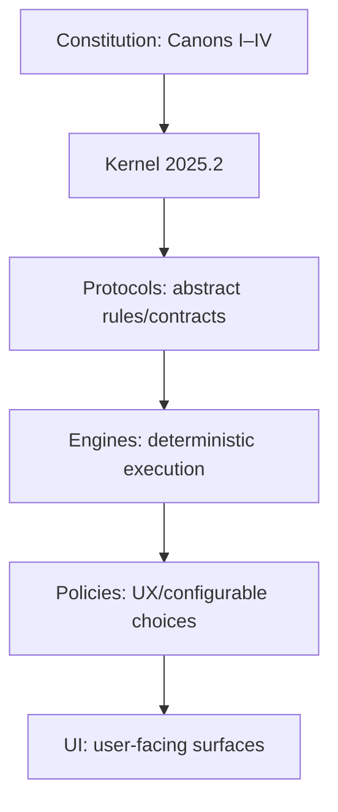
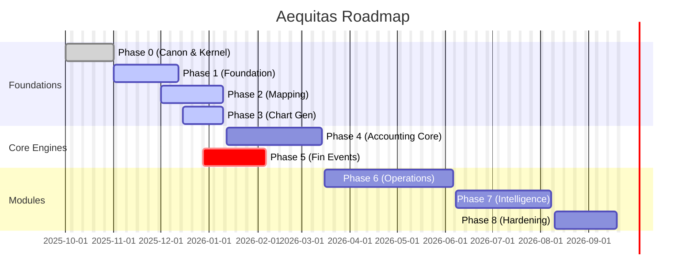
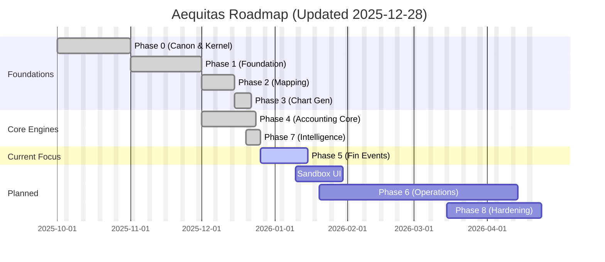
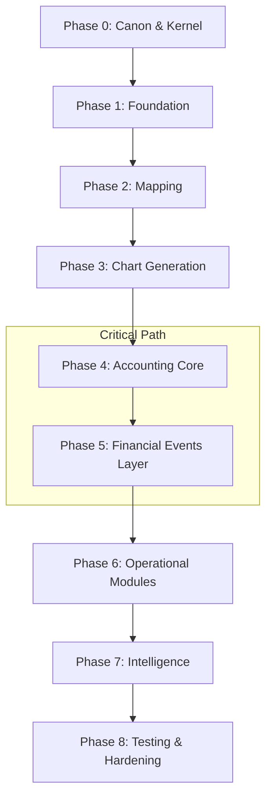

# Aequitas Roadmap Master

## A) "Now" Panel
- **Current focus:** Phase 5 (Financial Event Layer) + Operational Module UX Truth
- **Primary goals:**
  - [[GOAL — Formal Financial Event Taxonomy (Canon)]] (active)
  - [[GOAL — Sandbox UI]] (high priority - backend operational, UI missing)
- **Biggest blocker:** Ghost modules creating false UX expectations (see [[AUDIT — 2025-12-28 Ghost Modules and Headless Systems]])
- **Next 3 actions:**
  1. Review Financial Event Taxonomy progress
  2. Prioritize Sandbox UI implementation (backend proven, high ROI)
  3. Update module selector UX to show "Coming Soon" for unimplemented modules

## B) Project Health
```dataview
TABLE 
  round(length(filter(rows.status, (s) => s = "done")) / length(rows) * 100) + "%" as "% Done",
  length(filter(rows.status, (s) => s = "blocked")) as "Blocked",
  length(filter(rows.status, (s) => s = "active")) as "Active"
FROM "03_GOALS_EPICS"
WHERE type = "goal"
GROUP BY type
```
**Last Daily Log:**
```dataview
LIST limit(rows.file.link, 1)
FROM "01_DAILY"
SORT file.name DESC
GROUP BY type
```

## C) Open Blockers
```dataview
TABLE blockers, detailed_status
FROM "01_DAILY" OR "03_GOALS_EPICS"
WHERE (type = "daily" AND length(blockers) > 0) OR (type = "goal" AND status = "blocked")
SORT file.mtime DESC
```

## D) Active Goals
```dataview
TABLE status, phase, length(depends_on) as "Deps", updated
FROM "03_GOALS_EPICS"
WHERE type = "goal" AND (status = "active" OR status = "blocked" OR status = "partial")
SORT status ASC
```

## E) Next Up (Planned & Ready)
```dataview
TABLE phase, "Ready to start" as Reason
FROM "03_GOALS_EPICS"
WHERE type = "goal" AND status = "planned" AND (!depends_on OR length(depends_on) = 0)
SORT phase ASC
```

## F) Phases Overview
```dataview
TABLE status, length(rows) as "Goals", round(length(filter(rows.status, (s) => s = "done")) / length(rows) * 100) + "%" as "% Done"
FROM "03_GOALS_EPICS"
WHERE type = "goal"
GROUP BY phase
SORT phase ASC
```

## G) Decisions
```dataview
TABLE date, decision
FROM "04_DECISIONS"
SORT date DESC
LIMIT 10
```

## H) Audits
```dataview
TABLE date, risk, findings
FROM "05_AUDITS"
SORT date DESC
LIMIT 10
```

## I) Prompts Log
```dataview
TABLE target_agent, objective
FROM "06_PROMPTS"
SORT file.name DESC
LIMIT 10
```

## J) Daily Diary Feed
```dataview
TABLE without id file.link as "Date", goals as "Focus", length(goals) as "Goals Linked"
FROM "01_DAILY"
SORT file.name DESC
LIMIT 14
```

## K) Mermaid Visuals
### Dependency Flowchart


### Roadmap Gantt


---

## ⚠️ Data Hygiene Warnings
### Goals missing Phase
```dataview
LIST
FROM "03_GOALS_EPICS"
WHERE type = "goal" AND !phase
```
### Goals missing Status
```dataview
LIST
FROM "03_GOALS_EPICS"
WHERE type = "goal" AND !status
```
### Dailies missing Date
```dataview
LIST
FROM "01_DAILY"
WHERE type = "daily" AND !date
```

---

## Fallback Mode (No Dataview)
> If Dataview is off, use [[AEQUITAS_DASHBOARD]] (legacy link) or manual index below.

### Manual Index
- **Phases**: [[Phase 0 — Canon & Kernel]], [[Phase 1 — Foundation]], [[Phase 2 — Mapping]], [[Phase 3 — Chart Generation]], [[Phase 4 — Accounting Core]], [[Phase 5 — Financial Events Layer]], [[Phase 6 — Operational Modules]], [[Phase 7 — Intelligence (Dexter)]], [[Phase 8 — Testing & Hardening]]
- **Goals**: [[GOAL — Formal Financial Event Taxonomy (Canon)]], [[GOAL — Materialization Rules Engine]], [[GOAL — Invoicing Module]], [[GOAL — Assets Module]], [[GOAL — Sandbox UI]], [[GOAL — Reporting UI completion]], [[GOAL — Integrations foundation]], [[GOAL — Testing & Hardening baseline]]

---

## L) Archive / Previous Content
# Aequitas Roadmap Master

## 0. How to use this
- This vault is the board.
- Everything links to **Goals** and **Dailies**.
- Nothing here implies code is done; done = verified in code or explicitly marked as “docs-only”.

## 1. Vision
- **Canon-based accounting kernel** + **financial operations hub** (invoicing, assets, depreciation, payments) feeding an immutable ledger.
- **Invoice-first UX** driving automated journaling and asset lifecycle management.

## 2. Canon Guardrails (Non-negotiable)
- **Canon I**: Accounting Truth.
- **Canon II**: Authority & Power.
- **Canon III**: Evolution & State.
- **Canon IV**: Intelligence & Guidance.
- **Kernel 2025.2**: The frozen core authority.
- **No Ghost Modules**: If a module is shown, it must be operational or labeled "Coming Soon".

## 3. Current Reality Dashboard (Truth table)

### Core Accounting (Production-Ready)
| Feature | Backend | Frontend | User-Accessible | Link |
| :--- | :--- | :--- | :--- | :--- |
| **Authentication** | ✅ Done | ✅ Done | Yes | [[GOAL — Authentication]] |
| **Multi-tenancy** | ✅ Done | ✅ Done | Yes | [[GOAL — Multi-tenancy]] |
| **Onboarding Flow** | ✅ Done | ✅ Done | Yes | [[GOAL — Onboarding Flow]] |
| **Company Management** | ✅ Done | ✅ Done | Yes | [[Phase 1 — Foundation]] |
| **Master Chart** | ✅ Done | ✅ Done | Yes | [[Phase 3 — Chart Generation]] |
| **Company Chart** | ✅ Done | ✅ Done | Yes | [[Phase 3 — Chart Generation]] |
| **Account Mapping** | ✅ Done | ✅ Done | Yes | [[Phase 2 — Mapping]] |
| **Journal Entries** | ✅ Done | ✅ Done | Yes | [[Phase 4 — Accounting Core]] |
| **Ledger** | ✅ Done | ✅ Done | Yes | [[Phase 4 — Accounting Core]] |
| **Trial Balance** | ✅ Done | ✅ Done | Yes | [[Phase 4 — Accounting Core]] |
| **Financial Statements** | ✅ Done | ✅ Done | Yes | [[Phase 4 — Accounting Core]] |
| **Fiscal Periods** | ✅ Done | ✅ Done | Yes | [[Phase 4 — Accounting Core]] |
| **QuickBooks Integration** | ✅ Done | ✅ Done | Yes | [[Phase 2 — Mapping]] |

### Intelligence (Advanced Features)
| Feature | Backend | Frontend | User-Accessible | Link |
| :--- | :--- | :--- | :--- | :--- |
| **Dexter Observer** | ✅ Done | ✅ Done | Yes | [[GOAL — Dexter Observer]] |
| **Fiscal Engine (Tax)** | ✅ Done | 🔴 No UI | API only | [[GOAL — Fiscal Engine]] |
| **Sandbox Engine** | ✅ Done | 🔴 No UI | API only | [[GOAL — Sandbox UI]] |
| **Organizer AI** | ✅ Done | ✅ Done | Yes | [[Phase 7 — Intelligence (Dexter)]] |

### Operational Modules (Planned)
| Module | Backend | Frontend | Status | Link |
| :--- | :--- | :--- | :--- | :--- |
| **Invoicing** | 🔴 Enum only | 🔴 Missing | Ghost module | [[GOAL — Invoicing Module]] |
| **Assets** | 🟡 Partial | 🟡 Partial | Accounts only, no depreciation | [[GOAL — Assets Module]] |
| **Payroll** | 🔴 Enum only | 🔴 Missing | Ghost module | [[GOAL — Payroll Module]] |
| **Inventory** | 🔴 Enum only | 🔴 Missing | Ghost module | |
| **Contracts** | 🔴 Enum only | 🔴 Missing | Ghost module | |

### Reporting
| Feature | Backend | Frontend | User-Accessible | Link |
| :--- | :--- | :--- | :--- | :--- |
| **Financial Statements** | ✅ Done | ✅ Done | Yes | [[Phase 4 — Accounting Core]] |
| **Custom Reports** | 🔴 Missing | 🟡 Page exists | Placeholder only | [[GOAL — Reporting UI completion]] |
| **Export (CSV)** | ✅ Done | ✅ Done | Yes | |

**Key**: ✅ Done | 🟡 Partial | 🔴 Missing | ⚪ Planned

## 4. Roadmap Timeline





## 5. Phases index
- [[Phase 0 — Canon & Kernel]] ✅ Done
- [[Phase 1 — Foundation]] ✅ Done (Auth, multi-tenancy, onboarding, infrastructure)
- [[Phase 2 — Mapping]] ✅ Done (Account mapping, QuickBooks integration, API contracts)
- [[Phase 3 — Chart Generation]] ✅ Done (Master chart, templates, materialization)
- [[Phase 4 — Accounting Core]] ✅ Done (Journal entries, ledger, trial balance, financial statements, fiscal periods)
- [[Phase 5 — Financial Events Layer]] 🟡 Partial (Current Focus - taxonomy in progress, materialization engine planned)
- [[Phase 6 — Operational Modules]] ⚪ Planned (Framework exists, modules not implemented)
- [[Phase 7 — Intelligence (Dexter)]] ✅ Done (Dexter Observer, Fiscal Engine, Sandbox Engine backend, Organizer AI)
- [[Phase 8 — Testing & Hardening]] ⚪ Planned

## 6. Strategic Threads (Epics)
- **Financial Event Layer**: [[GOAL — Formal Financial Event Taxonomy (Canon)]] → [[GOAL — Materialization Rules Engine]]
- **Sandbox UI**: [[GOAL — Sandbox UI]] (Unlock headless backend)
- **Invoicing**: [[GOAL — Invoicing Module]] (Invoice-first accounting UX)
- **Assets**: [[GOAL — Assets Module]]
- **Module Safety**: [[GOAL — Module Rematerialization]]
- **Integrations**: [[GOAL — Integrations foundation]]
- **Quality**: [[GOAL — Testing & Hardening baseline]]

## 7. Daily Work Diary
*Latest 14 Daily Notes:*
```dataview
TABLE without id file.link as "Date", goals as "Focus", blockers as "Blockers"
FROM "01_DAILY"
SORT file.name DESC
LIMIT 14
```

*Open Tasks:*
```dataview
TASK
WHERE !completed
LIMIT 20
```

## 8. Today's Divergent Steps
> Daily work goes in the daily note; link the daily to the goal(s).

## 9. Quality & Open Loops
### Master Open Loops
- [ ] List blockers here...
- [ ] Unresolved decisions...

### No Lies UX Checklist
- [ ] Module operational OR labeled "Coming Soon" with explanation.

### Canon Compliance
- [ ] Canon I checked?
- [ ] Kernel invariants respected?
- [ ] Authority boundaries clear?

### Metrics
- Kernel compliance: ___
- Module coverage: ___
- User onboarding success: ___
