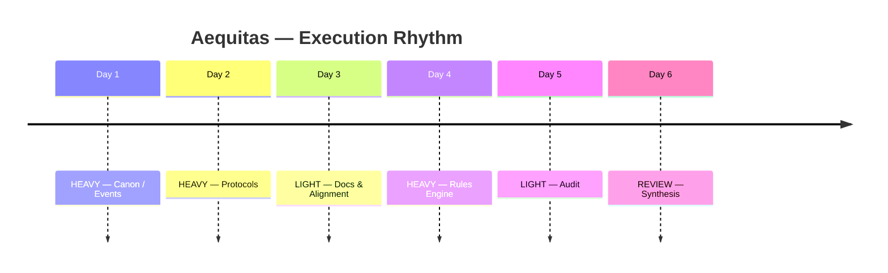

# Master Execution Calendar

> [!QUOTE] Design Philosophy
> **“The calendar protects the system from the human, and the human from the system.”**

This is a **cadence calendar**, not a commitment device. It defines **how** we work today, not necessarily **what** specific task must be completed (that is for the Roadmap).

Its purpose is to:
1.  **Define Day Modes** (How hard should today be?)
2.  **Set Focus Axes** (What kind of thinking is allowed?)
3.  **Preserve History** (Where did we diverge?)

---

## 1. Day Modes

| Mode | Symbol | Name | Duration | Purpose |
| :--- | :---: | :--- | :--- | :--- |
| **HEAVY** | 🟥 | **Deep Work** | 8–12h | Deep canonical work, architectural design, complex protocol definitions. **Max 2 in a row.** |
| **LIGHT** | 🟩 | **Stabilization** | 4–7h | Cleanup, documentation, integration, small fixes. No new Canons. |
| **REVIEW** | 🟦 | **Synthesis** | 2–4h | Planning, retrospection, auditing recent work, aligning roadmap. |
| **OFF** | ⬜ | **Rest** | 0h | No obligation. System shutdown. |

---

## 2. Focus Axes

Select one primary axis per day.

*   **CANON** — Constitution, high-level truth, Authority definitions.
*   **PROTOCOL** — Process definitions, rigid workflows, safety rules.
*   **ENGINE** — Computational logic, state machines, automation.
*   **UX** — User interaction, onboarding, frontend experience.
*   **AUDIT** — Checking truth vs reality, finding discrepancies.
*   **DOCS** — Explanations, manuals, Obsidian structure.
*   **META** — Working on the system itself (like this calendar).
*   **RECOVERY** — Fixing debt, refactoring, renaming.

---

## 3. Weekly Execution Table

*Copy-paste this table for each new week.*

**Rules:**
*   **Max 2 HEAVY days (🟥) in a row.**
*   Every HEAVY block must be followed by LIGHT (🟩) or REVIEW (🟦).
*   Targets are aspirational; record actual output in Daily Notes.

| Date       | Mode (🟥/🟩/🟦/⬜) | Focus Axis | Target (Aspirational) | Expected Output  |
| :--------- | :---------------: | :--------- | :-------------------- | :--------------- |
| YYYY-MM-DD |        🟥         | CANON      | Define Authority      | Updated Canon IV |
| YYYY-MM-DD |        🟥         | ENGINE     | Rules Engine          | Draft logic      |
| YYYY-MM-DD |        🟩         | DOCS       | Cleanup               | Renamed files    |
| YYYY-MM-DD |        🟦         | REVIEW     | Weekly Audit          | Audit Note       |
| YYYY-MM-DD |         ⬜         | OFF        | -                     | -                |
| YYYY-MM-DD |         ⬜         | OFF        | -                     | -                |
| YYYY-MM-DD |         ⬜         | OFF        | -                     | -                |

---

## 4. Visualization (Illustrative)

This timeline shows the **rhythm**, not the specific dates.

---

## 5. Usage in Daily Notes

Every Daily Note links back here.
*   Check the Calendar in the morning.
*   Respect the **Mode**. Do not try to do HEAVY work on a LIGHT day.
*   If you diverge, **update the Weekly Table** to reflect reality. History > Plan.
